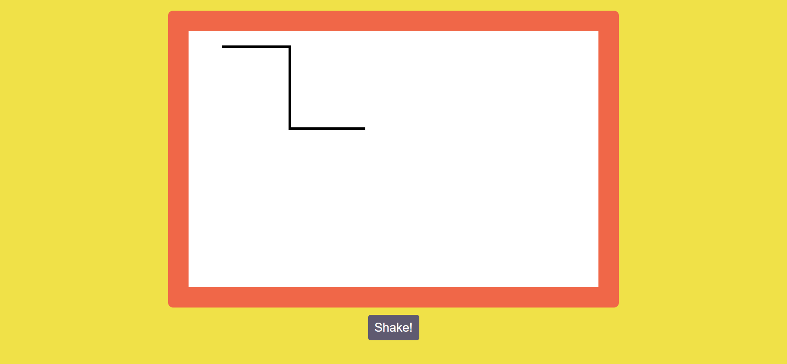

# Etch a Sketch - Project from Beginner JavaScript

This is a project for Wes Boss's 'Beginner JavaScript' course.
This project is only aviable in desktops. Users should be able to draw using the arrow keys and clear the canvas using the 'Shake' button. 

### Screenshot

### Links

- Live Site URL: [https://cl4ram.github.io/etch-a-sketch/](https://cl4ram.github.io/etch-a-sketch/)

## My process

- HTML Canvas Graphics
- Vanilla JS

